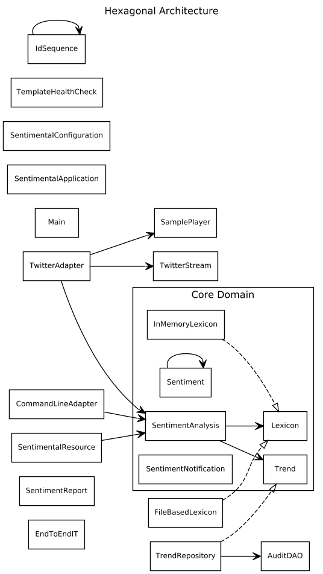

# hexagonal-sentimental
Sample app of sentiment analysis as an example of hexagonal architecture

*Automatically extract the sentiment of English sentences submitted on the web, using a given lexicon. Keep track of the submitted sentences.*

## Architecture

## Running the app

in the command line:

    mvn package

then:

    cd git/hexagonal-sentimental/sentimental
    java -jar target/sentimental-0.0.1-SNAPSHOT.jar server sentimental.yml

## Remarks

- There is an **End-to-end test** marked as @ignored until you install postgres; this test is very convenient
- The **auto-generation of the living diagram** now uses the graphviz-java plugin instead of the dot-diagram library created by Cyriux. Therefore the installation of **Graphviz** isn't required.
- The sound files are not mine and are only provided as examples; unfortunately I don't remember where they come from.

*This project had been deleted and re-created after I realized some private keys had been accidentaly committed.*
